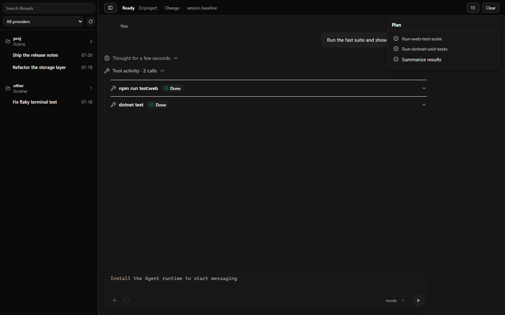

# PSX

Languages: [English](README.md) | [简体中文](docs/zh-CN/README.md)

PSX is a Windows desktop terminal for AI Agent workflows. It is not trying to be
another PowerShell. It packages a terminal, an Agent conversation panel, task
plans, .NET, and Portable Node into a lightweight app that can be unzipped and
run directly. Terminal mode is ready immediately; Agent mode installs its ACP
runtime from the official npm registry only after the user confirms.

Many polished Agent applications start with an installer, then download more
runtime components after installation. That is often unfriendly on company
laptops, locked-down networks, machines without admin rights, or environments
where users cannot freely install software. PSX keeps the application itself
portable: download one zip, extract it, run `PSX.exe`, and start using the
Terminal. The optional Agent runtime is installed on first use instead of being
redistributed inside the public package.

## Why PSX Exists

The core value of PSX is:

- **Portable first**: distributed as a zip, no installer required.
- **Terminal ready immediately**: the release package includes the .NET runtime
  and Portable Node; no installer or administrator access is required.
- **Explicit Agent setup**: PSX downloads the ACP runtime only after the user
  opens Agent mode and confirms the installation.
- **More than a terminal**: PSX includes a dedicated Agent panel in addition to
  normal terminal tabs.
- **Clear Agent workflow**: conversations, tool calls, permission prompts, and
  task plans are separated in the interface.
- **Right-side plan panel**: model-generated plans are shown beside the
  conversation instead of being buried inside the chat stream.

PSX is for people who want to run Claude Code / ACP Agent / node / npm / git and
other command-line tools on Windows, while keeping the experience lightweight,
controllable, and easy to distribute on work machines.



## Features

- Terminal mode with real Windows ConPTY sessions.
- Multiple terminal tabs.
- Agent mode for ACP-compatible Claude sessions.
- Right-side task plan panel with completed items checked and struck through.
- Tool call cards for Agent inputs and outputs.
- Permission and question prompts handled in the UI.
- Theme and font configuration through `psx.ini` and `theme-presets/`.
- Portable Windows x64 release with .NET and Node included.

## Download

Download the latest Windows build from GitHub Releases:

```text
PSX-1.1.2-win-x64-portable.zip
```

Usage:

1. Download the zip.
2. Extract it to a directory where your account has write access.
3. Run `PSX.exe`.

PSX currently targets Windows x64. Microsoft Edge WebView2 Runtime is required.
If WebView2 is not installed, PSX will show a prompt instead of opening a blank
window.

The release package includes the .NET runtime, Portable Node, and the ACP seed
manifests. It deliberately does **not** include `claude.exe` or an installed ACP
runtime.

## First-time Agent Setup

Terminal mode works immediately and never starts an npm download. The first
time you open Agent mode, PSX shows an installation card. Choose **Install Agent
runtime** to download the pinned ACP dependencies from the official npm
registry. The UI shows progress and supports cancellation and retry. Agent input
remains disabled until installation succeeds; no restart is required afterward.

The installed runtime is stored under `runtime/` beside `PSX.exe`. The same
extracted directory reuses it on later launches, while a newly extracted copy
needs its own first-time download. Keep the PSX directory writable and preserve
it if you want to keep the installed runtime. Network access to the npm registry
is required for this step.

PSX does not read, store, or display API keys. Configure credentials and
provider settings using the tools supported by the Agent runtime. As an optional
third-party convenience, [CC Switch](https://github.com/farion1231/cc-switch)
can manage Claude Code provider configurations. CC Switch is not part of PSX
and is not an official PSX or Anthropic component.

## Configuration

PSX reads its active configuration from `psx.ini` in the application directory.
In a portable release, this is the same folder as `PSX.exe`. When running from
source, the active file is the copy in the build output directory (for example,
`bin/Debug/net10.0-windows/psx.ini`), not the repository-root source file.
The active file is managed by PSX: edit a custom theme instead of changing its
appearance fields directly. Advanced users may still carefully edit non-theme
settings that do not yet have a UI.

Use the global **Theme** menu to preview and confirm a preset without restarting
PSX. Built-in themes come from `theme-presets/`; custom themes come from
`%USERPROFILE%\.psx\themes`. Previewing is temporary. Confirming validates the
theme, backs up the active configuration, and atomically updates `psx.ini`.

Common sections:

```ini
[terminal]
fontSize=14
fontFamily=Cascadia Code, Consolas, monospace
scrollback=10000

[agent]
fontSize=14
fontFamily=Cascadia Code, Segoe UI, Microsoft YaHei UI, Microsoft YaHei, sans-serif
monoFontFamily=Cascadia Code, Consolas, monospace

[shell]
defaultProfile=powershell
```

Theme colors live in:

- `[theme]` - shared WPF and Agent background, surface, text, border, accent,
  and state colors
- `[agentTheme]` - Agent-specific code blocks, buttons, permission cards,
  overlays, and focus colors
- `[terminalColors]` - xterm.js foreground, cursor, selection, and ANSI color
  palette

Theme colors and Terminal/Agent fonts update live. Other manual configuration
changes continue to take effect on the next launch.

## Build From Source

Requirements:

- Windows 10/11 x64
- .NET SDK selected by `global.json`
- PowerShell
- Network access for release builds, because the release script downloads
  Portable Node unless a verified cache is explicitly requested

Build:

```powershell
dotnet build PSX.slnx
```

Run:

```powershell
dotnet run --project PSX.csproj
```

Create a portable release package:

```powershell
powershell -ExecutionPolicy Bypass -File tools/build-release.ps1
```

Run the automated test gates:

```powershell
# Daily development and CI
powershell -ExecutionPolicy Bypass -File tools/test.ps1 -Suite Fast

# Local release gate, including Windows desktop probes and package validation
powershell -ExecutionPolicy Bypass -File tools/test.ps1 -Suite Full
```

See [docs/testing.md](docs/testing.md) for the test layers, repository-isolation rules,
diagnostic artifacts, and the real-Agent checks that remain manual.

The release zip is written to:

```text
bin/releases/
```

## Technical Design

PSX is built with:

- C# / WPF for the desktop window, application state, and native UI.
- WebView2 for the terminal and Agent frontend.
- xterm.js for terminal rendering, ANSI sequences, input, and scrollback.
- Windows ConPTY for real pseudo-console sessions.
- ACP runtime for Claude sessions in Agent mode.

These technologies are implementation details. The goal of PSX is to provide a
lightweight Windows desktop entry point for AI Agent CLI workflows, especially
in environments where installing a heavier application is inconvenient.

## Project Structure

- `Services/` - terminal, Agent, ACP runtime, settings, and thread persistence
- `Models/` - settings, terminal, and Agent DTOs
- `ViewModels/` - WPF UI state
- `Controls/` - WPF controls and terminal host integration
- `Helpers/` - ConPTY and process helpers
- `wwwroot/` - WebView2 frontend for xterm.js and Agent mode
- `theme-presets/` - preset theme configuration files
- `tools/build-release.ps1` - portable release builder
- `tools/acp-seed/` - pinned manifests used for the user-confirmed Agent install

## Release Notes For Maintainers

The release script creates a self-contained Windows x64 portable package. It
stages the published WPF app, downloads and verifies Portable Node 22.23.1, and
includes the ACP seed manifests. Before writing the archive it validates the
application, Node, npm, frontend, seed, and license files. It also rejects any
package containing `claude.exe`, `runtime/acp-current`, logs, or temporary files.

Recommended package name:

```text
PSX-<version>-win-x64-portable.zip
```

`-SkipNodeDownload` only accepts an existing Node archive whose SHA-256 matches
the pinned value; it fails when the cache is absent or invalid.

## License

PSX is licensed under the [MIT License](LICENSE.txt). Bundled dependency license
and notice information is in [THIRD-PARTY-NOTICES.md](THIRD-PARTY-NOTICES.md)
and the `licenses/` directory. Anthropic components are installed later by the
user and remain subject to their own terms.
