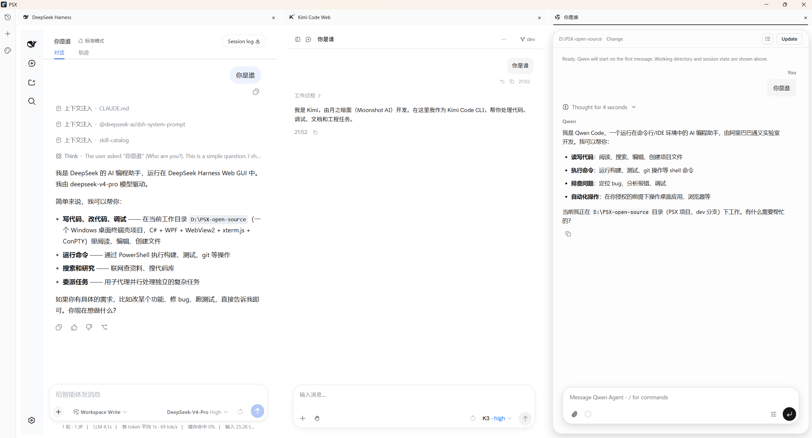
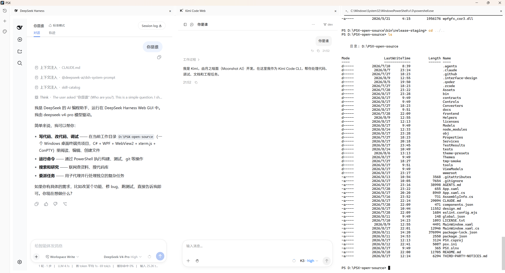

# PSX

Languages: [English](README.md) | [简体中文](docs/zh-CN/README.md)

PSX is a Windows desktop terminal for AI Agent workflows. It is not trying to be
another PowerShell. It packages a terminal, an Agent conversation panel, task
plans, .NET, and Portable Node into a lightweight app that can be unzipped and
run directly. Terminal mode is ready immediately; Agent mode uses curated
bundled baselines or installs a managed runtime from the official npm registry
only after the user confirms.

Many polished Agent applications start with an installer, then download more
runtime components after installation. That is often unfriendly on company
laptops, locked-down networks, machines without admin rights, or environments
where users cannot freely install software. PSX keeps the application itself
portable: download one zip, extract it, run `PSX.exe`, and start using the
Terminal. The optional Agent runtime is installed on first use instead of being
redistributed inside the public package.

## Why PSX Exists

The core value of PSX is:

- **Portable first**: distributed as a zip, no installer required.
- **Terminal ready immediately**: the release package includes the .NET runtime
  and Portable Node; no installer or administrator access is required.
- **Explicit Agent setup**: when a Provider needs a downloaded runtime, PSX
  contacts npm only after the user confirms the installation or update.
- **One workspace for every mode**: mix Terminal, ACP Agent, and Web App tabs
  across as many as three side-by-side columns, without hiding background
  workspaces.
- **Clear Agent workflow**: conversations, tool calls, permission prompts, and
  task plans are separated in the interface.
- **Four managed providers**: Claude Code, Kimi Code, Qwen Code, and OpenCode
  use curated runtime adapters rather than arbitrary
  executables.
- **Managed Web Apps**: Kimi Code Web and DeepSeek Harness run in dedicated
  local WebView workspaces while keeping their own application data and
  settings.
- **Global history and configuration**: History, profile, exact usage where a
  provider supports it, and sanitized user-level configuration remain available
  even when the workspace contains only Terminal tabs.
- **Pane-local plans**: model-generated plans stay with their Agent workspace as
  a floating card or narrow overlay, instead of consuming a fixed layout column.
- **Modern Agent UI**: the conversation panel is built on shadcn/ui and
  AI Elements with Vercel Neutral dark/light presets; reasoning, tool calls,
  permissions and history all share one design language.

PSX is for people who want to run Claude Code / ACP Agent / node / npm / git and
other command-line tools on Windows, while keeping the experience lightweight,
controllable, and easy to distribute on work machines.

<picture>
  <source media="(prefers-color-scheme: dark)" srcset="docs/assets/psx-web-app-workspaces-dark.png">
  <source media="(prefers-color-scheme: light)" srcset="docs/assets/psx-web-app-workspaces-light.png">
  
</picture>

## Features

- Terminal mode with real Windows ConPTY sessions.
- Mixed Terminal, Agent, and Web App tab stacks in up to three resizable
  columns.
- Managed ACP sessions for Claude Code, Kimi Code, Qwen Code, and OpenCode.
- Embedded Kimi Code Web and DeepSeek Harness workspaces, each limited to one
  running workspace per PSX process.
- Process-wide History plus profile, Usage, and sanitized Config views.
- Workspace-local task Plan card/overlay with completed items checked and
  struck through.
- Tool call cards for Agent inputs and outputs.
- Permission and question prompts handled in the UI.
- Theme and font configuration through `psx.ini` and `theme-presets/`.
- Portable Windows x64 release with .NET and Node included.

<picture>
  <source media="(prefers-color-scheme: dark)" srcset="docs/assets/psx-web-app-terminal-dark.png">
  <source media="(prefers-color-scheme: light)" srcset="docs/assets/psx-web-app-terminal-light.png">
  
</picture>

## Download

Download the latest Windows build from GitHub Releases:

```text
PSX-1.2.0-win-x64-portable.zip
```

Usage:

1. Download the zip.
2. Extract it to a directory where your account has write access.
3. Run `PSX.exe`.

PSX currently targets Windows x64. Microsoft Edge WebView2 Runtime is required.
If WebView2 is not installed, PSX will show a prompt instead of opening a blank
window.

The release package includes the .NET runtime, Portable Node, the Claude and
DeepSeek Harness seed manifests, and curated bundled baselines for Kimi, Qwen,
and OpenCode. It deliberately does **not** include `claude.exe`, DeepSeek
Harness, or a user-installed runtime under `runtime/`.

## First-time Runtime Setup

Terminal mode works immediately and startup never starts an npm download.
Kimi Code, Qwen Code, and OpenCode can use the curated baseline shipped in the
portable package. Claude Code requires explicit install confirmation before PSX
downloads its managed runtime from the official npm registry. Installation and
user-triggered updates show progress and support
cancellation/retry; cancelling does not leave the runtime directory locked.

Kimi Code Web uses the bundled Kimi runtime. DeepSeek Harness is a separate Web
App workspace: its first install is pinned to the audited seed version and is
started only after an explicit in-app confirmation. DeepSeek Harness updates are
also manual; PSX never checks for or applies them automatically.

Downloaded or updated runtimes are stored under `runtime/` beside `PSX.exe` and
reused by that extracted copy. Keep the PSX directory writable and preserve it
when upgrading if you want to retain those runtime copies. PSX startup only
promotes an already-staged update locally; it never contacts npm on its own.

PSX does not read, store, or display API keys. Configure credentials and
provider settings using the tools supported by the Agent runtime. As an optional
third-party convenience, [CC Switch](https://github.com/farion1231/cc-switch)
can manage Claude Code provider configurations. CC Switch is not part of PSX
and is not an official PSX or Anthropic component.

## Configuration

PSX reads its active configuration from `psx.ini` in the application directory.
In a portable release, this is the same folder as `PSX.exe`. When running from
source, the active file is the copy in the build output directory (for example,
`bin/Debug/net10.0-windows/psx.ini`), not the repository-root source file.
The active file is managed by PSX: edit a custom theme instead of changing its
appearance fields directly. Advanced users may still carefully edit non-theme
settings that do not yet have a UI.

Use the global **Theme** menu to preview and confirm a preset without restarting
PSX. Built-in themes come from `theme-presets/`; custom themes come from
`%USERPROFILE%\.psx\themes`. Previewing is temporary. Confirming validates the
theme, backs up the active configuration, and atomically updates `psx.ini`.

Common sections:

```ini
[terminal]
fontSize=14
fontFamily=Cascadia Code, Consolas, monospace
scrollback=10000

[agent]
fontSize=14
fontFamily=Segoe UI Variable Text, Segoe UI, Microsoft YaHei UI, Segoe UI Emoji, sans-serif
monoFontFamily=PSX Maple Mono, Segoe UI Emoji, Microsoft YaHei UI, monospace

[shell]
defaultProfile=powershell
```

Theme colors live in:

- `[theme]` - shared WPF and Agent background, surface, text, border, accent,
  and state colors
- `[agentTheme]` - Agent-specific code blocks, buttons, permission cards,
  overlays, and focus colors
- `[terminalColors]` - xterm.js foreground, cursor, selection, and ANSI color
  palette

Theme colors and Terminal/Agent fonts update live. Other manual configuration
changes continue to take effect on the next launch.

## Build From Source

Requirements:

- Windows 10/11 x64
- .NET SDK selected by `global.json`
- PowerShell
- Network access for release builds, because the release script downloads
  Portable Node unless a verified cache is explicitly requested

Build:

```powershell
dotnet build PSX.slnx
```

The Agent interface is implemented as independently loaded React islands. The
web frontend sources live in `frontend/webview/` (shell) and
`frontend/agent/src/` (Agent TypeScript/TSX); the Vite build output under
`wwwroot/app/` is committed so ordinary .NET builds do not require Node. After
changing web frontend source, rebuild and verify the committed output:

```powershell
npm.cmd run build:web
npm.cmd run verify:web
npm.cmd run typecheck:web
npm.cmd run lint:web
npm.cmd run test:web
```

Run:

```powershell
dotnet run --project PSX.csproj
```

Create a portable release package:

```powershell
powershell -ExecutionPolicy Bypass -File tools/build-release.ps1
```

Run the automated test gates:

```powershell
# Daily development and CI
powershell -ExecutionPolicy Bypass -File tools/test.ps1 -Suite Fast

# Local release gate: Desktop/package smoke, locked-Chromium visual/axe, audits
powershell -ExecutionPolicy Bypass -File tools/test.ps1 -Suite Full
```

See [docs/testing.md](docs/testing.md) for the test layers, repository-isolation rules,
diagnostic artifacts, and the real-Agent checks that remain manual.

The release zip is written to:

```text
bin/releases/
```

## Technical Design

PSX is built with:

- C# / WPF for the desktop window, application state, and native UI.
- WebView2 for the terminal and Agent frontend.
- xterm.js for terminal rendering, ANSI sequences, input, and scrollback.
- Windows ConPTY for real pseudo-console sessions.
- ACP runtimes for the four managed Agent providers.
- Managed local Web App workspaces for Kimi Code Web and DeepSeek Harness.

These technologies are implementation details. The goal of PSX is to provide a
lightweight Windows desktop entry point for AI Agent CLI workflows, especially
in environments where installing a heavier application is inconvenient.

## Project Structure

- `Services/` - terminal, Agent, ACP runtime, settings, and thread persistence
- `Models/` - settings, terminal, and Agent DTOs
- `ViewModels/` - WPF UI state
- `Controls/` - WPF controls and terminal host integration
- `Helpers/` - ConPTY and process helpers
- `wwwroot/` - WebView2 frontend for xterm.js and Agent mode
- `theme-presets/` - preset theme configuration files
- `tools/build-release.ps1` - portable release builder
- `tools/acp-seed/` - manifest and Windows platform policy used for the user-confirmed latest Agent install
- `tools/dsh-seed/` - pinned DeepSeek Harness manifest used for its
  user-confirmed first install
- `tools/dsh-locks/` - hash-pinned pre-generated DSH update lockfiles
  (`catalog.json` plus per-version `package.json`/`package-lock.json`) that
  the update path installs with `npm ci`; produced by
  `tools/generate-dsh-lock.ps1` under its isolation contract and gated by
  `DshLockCatalogTests` plus the release verifier

## Release Notes For Maintainers

The release script creates a self-contained Windows x64 portable package. It
stages the published WPF app, downloads and verifies Portable Node 22.23.1, and
assembles the seed/bundled runtime inputs described above. Before writing the
archive it validates the application, Node, npm, frontend, runtime entries, and
license files. It also rejects any package containing `claude.exe`, installed
`runtime/*-current` directories, logs, or temporary files.

The portable archive also carries the complete Maple Mono Normal CN Regular
and SemiBold faces for deterministic Agent code typography. Natural-language
Agent content uses the proportional Windows UI font stack. The bundled faces
add about 35.4 MiB unpacked and approximately 16 MiB to the compressed release.

Recommended package name:

```text
PSX-<version>-win-x64-portable.zip
```

`-SkipNodeDownload` only accepts an existing Node archive whose SHA-256 matches
the pinned value; it fails when the cache is absent or invalid.

## License

PSX is licensed under the [MIT License](LICENSE.txt). Bundled dependency license
and notice information is in [THIRD-PARTY-NOTICES.md](THIRD-PARTY-NOTICES.md)
and the `licenses/` directory. Anthropic components are installed later by the
user and remain subject to their own terms.
