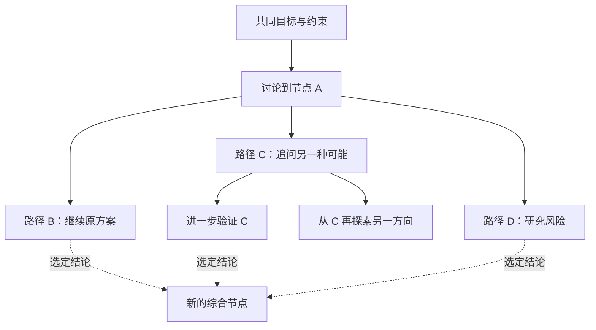

# PSX 非线性 Agent 画布调研与实施建议

**建议：保留 PSX 名字与当前 Windows 宿主，在独立实验分支验证“从历史节点分叉、独立继续、比较结果、带回结论”的完整体验。第一版以 Pi 为参考实现，只做一个可靠的 Agent 接入；跨平台与全面重写放在个人持续使用验证之后。**

这个方向值得投入一次范围明确的实验。它贴近真实需求：人在讨论问题时会产生旁支，又希望保留原来的思路和工作进度。不过，画布和多模型本身已经存在较多供给。PSX 需要验证的是，分支是否让具体任务更容易完成，以及结果能否重新汇集成可用的产物。

研究口径：面向个人开发者，第一目标是尽快做出自己每天愿意使用的版本。事实核验截至 2026-09-13；外部资料来自项目源码和官方文档。PiX 固定到提交 `7cd93bb95a0f2f7b937491d4d68756d275c60752`。PSX 结论基于当前本地工作树的定点阅读。本文没有运行第三方应用或模型，没有对性能、Provider 分叉正确性、商业转化进行实测；产品建议、预算和验收线均为分析判断。

## 产品定位与竞争空间

建议用一句话解释新方向：**PSX 是本地 Agent 分支工作台，让你从对话中的任意已完成节点探索另一条路径，再把有用的结论带回来。**

“任意节点”应在具体 Provider 的能力范围内成立；不支持准确分叉时要明确标识，不能只在画面上画一条分支线。第一版只对经过验证的 Pi 路径作这一承诺。

初始用户可以聚焦在独立开发者与技术创作者：已经在用 Agent，经常同时探索几种方案，愿意连接自己的模型服务，并且需要保留中间过程。第一任务可以是“围绕一个项目做技术方案探索”：主线明确问题，旁支研究不同方案，最终汇总成一份决策文档。这个场景与开发背景贴合，也能避免首次实验就卷入多 Agent 同时修改项目文件。

### 同类产品与可借鉴之处

| 产品 / 项目 | 官方资料确认的能力 | 与 PSX 的关系 | 借鉴重点 |
|---|---|---|---|
| PiX | Pi 会话的可视化分叉；当前源码具备独立并行分支与多层来源映射 | 最直接的参考与竞争对象 | 准确分叉、图与会话的映射、持久化与恢复 |
| Flowith Canvas | 空间化组织来源、对话、备选方案和审阅后的重组 | 验证了画布工作流这一产品类别，但没有证明 PSX 的具体需求 | 分支应围绕问题和决策命名；结果应可汇集 |
| CaudalFlow | 分叉、比较、合并，以及操作画布的 AI copilot；仓库标注 MIT | “可视化聊天加汇总”也已有直接供给 | side quest 的低门槛交互、比较与汇总 |
| tldraw Branching Chat | 连接消息节点，沿连接回溯上下文，流式生成回复 | 技术示例，不等于成熟的本地编码 Agent 平台 | 节点交互和上下文路径的可见性 |
| Msty Studio | 对话分支、Branch Explorer、多步骤工作流等 | 提醒我们：分支能力未必需要全画布才能有用 | 对照测试画布是否真的比清晰的分支列表好用 |
| TypingMind | Conversation Forking，支持连接多个模型服务 | 同样覆盖“另开方向且保留原对话”的基础需求 | 创建分支的操作成本 |
| Heptabase | 卡片、白板、AI 研究和知识组织，提供 MCP | 相邻的研究与知识沉淀产品，并非同一种 Agent 会话内核 | 长期整理、来源关联、回到旧项目时的可理解性 |

以上是官方资料所述能力，未通过付费账号逐项操作验收。不能据此推断其未公开的内部架构、付费转化或所有功能限制。来源：[PiX][s1]、[PiX 并行设计][s3]、[Flowith][s6]、[CaudalFlow][s7]、[tldraw 示例][s8]、[Msty][s9]、[TypingMind][s10]、[Heptabase][s11]。

这些候选也可帮助回忆以前用过的产品，但无法仅凭“画布、AI、分支”确定具体是哪一个。

### 差异化应该是可验证的任务体验

“本地、多 Agent、开源、画布”可以作为产品属性，但每个属性都容易被别的项目组合。更有辨识度的承诺是：

1. 分叉时知道带走了哪些上下文，原路径继续独立工作。
2. 同一问题的几个答案可以并排比较，并保留来源。
3. 把选中的结论带回主线，形成文档或实施决策，不用手工搬运大段聊天。
4. 后续支持不同 Agent 接力时，明确说明这是原生继承还是带资料重新开始。

这些也是待验证的假设，不能直接称作竞争壁垒。尤其不能把 PiX 的几十个 Star 当成市场规模或留存证明。本次 GitHub API 快照是 62 Star，而网页抓取快照显示 50；这是动态快照差异，只能说明有人表达过兴趣。[s1]

PSX 此前社交平台缺少反馈也不能直接证明产品失败。曝光量、受众、演示内容、安装门槛和任务价值都还没有被分开验证。下一轮推广应围绕一个可以看懂的任务，而不是罗列更多功能。

## PiX：它实际解决了什么

### 技术底座

固定提交的 `package.json` 显示：PiX 使用 Electron、Vue 3、Vue Flow、TypeScript，并依赖 `@earendil-works/pi-coding-agent` 等 Pi 包，版本锁定为 `0.85.0`。它不是 React 应用；PSX 可以借鉴会话设计，继续使用已有 React 技术栈。[s2]

旧的 `badlogic/pi-mono` SDK 页面目前重定向到 `earendil-works/pi`。应以实际选定版本的文档和类型为准，避免照抄旧包名或旧 API。当前 Pi SDK 文档把会话替换、fork 等操作放在 `AgentSessionRuntime`，并说明树导航在运行中会拒绝冲突操作。[s4]

### 分支运行与上下文

PiX 的 `GraphRuntime.startAt` 会检查目标是否为可分叉的完成节点；空闲末端可复用会话，历史位置则利用 Pi `SessionManager` 创建独立分支。运行事件带有图、分支和 run 的身份，停止操作也按运行身份定位。源码可直接观察到这些机制，而不只来自 README 的描述。[s5]

并行设计文档说明，主会话旁边的 `.pix-tree/` 保存子会话和分叉来源；分支不自动写回主会话。文档也明确分支共享项目工作目录，因此文件修改不隔离。这说明“Pi 原生会话格式”仍需辅以应用自己的关系和恢复数据，备份时不能只拿走主文件。[s3]

值得学习的工程原则是：图只是可视化投影；运行状态、持久化、来源关系和导出需要单独设计。也要区分“同一会话切换 active leaf”和“多个独立运行同时推进”，不能让一个可变会话游标承担并行执行。[s4][s5]

### 性能结论的边界

PiX 文档列出了视口裁剪、增量投影、稳定布局、轻量缩略图等策略，并给出特定机器上的大图测试记录。本文没有复现这些测试，因此不把其帧率当作 PSX 的指标，也不据此宣布 Electron 快于 WebView2。真正可借鉴的是避免每个流式 token 都触发全图布局和全文渲染。[s3]

### 代码复用边界

固定提交的文件清单中未发现许可证文件，GitHub API 的 `license` 字段为 `null`，README 检索也没有明确授权说明。**目前只能确认公开可读，不能把 PiX 当成已明确许可的开源代码底座。**若要复制实质代码再发布，应先取得明确许可；独立实现同类交互不依赖直接复制。[s1][s23]

Pi 自身的仓库有 MIT 许可证，可以按其许可要求作为实现底座；使用到的依赖和扩展仍应分别核对。[s24]

## 上下文模型：分支共享过去，分别积累未来

最重要的定义不是“所有 Agent 永远共享一套上下文”，而是：**它们共享分叉点之前的历史快照，分叉之后各自积累上下文。**否则分支 A 的追问会持续进入 B，无法达到避免混杂的目的。



这是任意数量子节点的树，不必限制成二叉树。需要引用多个来源时，再增加带类型的引用关系；不必第一版就允许任意连线形成复杂图。

### 三类状态必须分开

| 状态 | 含义 | 是否随对话 fork 自动恢复 |
|---|---|---|
| 对话上下文 | 系统约束、消息、工具调用与结果、压缩记录、附件 | 取决于 Provider 和具体 fork 接口 |
| Agent 运行状态 | 待审批操作、进行中工具、子 Agent、运行配置 | 不能默认继承；通常要求稳定边界 |
| 外部世界 | 代码文件、数据库、浏览器登录、已经发送的请求 | 不能由复制聊天历史自动恢复 |

Claude 官方也明确区分会话持久化与文件系统快照。[s14] 这意味着“回到昨天的对话节点”可以恢复当时的会话知识，却不代表今天磁盘上的文件变回昨天。

### 第一版的分叉语义

建议只允许从**完整结束且没有待处理工具结果的回合**分叉。一个图节点表示一轮用户输入及相应 Agent 过程；完整工具事件保存在内部，不把每个 token 或工具事件做成独立可拖拽节点。

提供两个不同动作：

- **从这里继续**：包含该轮完成结果，创建后续路径。
- **换个问法**：从该轮输入之前建立旁支，把原问题带入草稿。

两者的 before / after 边界必须明确。不能仅凭数组索引截断，因为不同 Provider 的 message ID 可能指用户消息、助手消息或整轮记录。

父分支在分叉后继续增长，子分支也不能自动获得后续消息。共同目标如果发生修改，生成新版本；允许显式应用到指定分支，并留下记录。用户只需看到“继承至节点 A”，不需要在日常操作里理解内部 JSON 格式。

### 压缩、附件与工具记录

长对话经过压缩后，不能机械地把完整祖先历史和最新摘要一起发送，造成重复或矛盾。准确继承时尽量交给原 Provider 的正式会话 API，PSX 记录关联位置、版本和可恢复性；自行构建上下文时则必须有独立规则与验证。

重启后附件应仍然可读取，不能依赖已经失效的临时 URL。一个工具调用与对应结果应成对处理；没有对应调用的结果不能伪装成原生工具消息。Provider 内部隐藏状态、思考数据或缓存不能假定可导出，更不能把它们作为跨 Provider 无损转移的前提。

## 多 Agent 接入：统一产品动作，允许不同底层能力

需要区分两件事：一个 Agent 使用不同模型服务，与接入多个完整 Agent 产品。Pi 调用某个模型，并不意味着它就具备 Claude Code、Kimi Code 或 OpenCode 的工具体系、配置和会话行为。

此外，Claude Code 可通过官方 SDK 集成，但不能与明确开放源码的项目一并笼统称作“开源 Agent”。接入权、源码许可和模型账户权限是不同问题。

### 当前能力与限制

| 引擎 / 接口 | 已确认的官方能力 | 尚不能直接承诺的部分 | 建议 |
|---|---|---|---|
| Pi SDK | SessionManager、树导航、fork，以及持久会话 API | 不同版本、压缩与扩展的边界仍需验证；运行中导航存在限制 | 第一版参考实现 |
| Claude Agent SDK | resume、fork；官方 cookbook 展示 `up_to_message_id` 的指定消息分叉 | 具体语言 / SDK 版本接口不同；不能推断 PSX 当前 ACP 包也暴露相同能力 | 第二阶段独立适配 |
| OpenCode Server API | `/session/:id/fork` 接受可选 `messageID` | 截断边界、权限与并发、压缩后的准确性需实测；不能推断 ACP 路径等价 | 第二阶段候选，可用于验证抽象 |
| Kimi Code ACP | 当前官方文档列出 `sessionCapabilities.fork` 与 `session/fork` | 文档未证明任意历史节点分叉；fork 请求中的 cwd 等参数会被忽略并警告 | 先支持已验证的会话末端分叉 |
| Kimi 本地 Server API | `:fork` 创建新会话 | 文档限定源会话所有 Agent 没有活动回合；参数表没有任意消息截点 | 不以它证明历史节点或运行中分叉 |
| 通用 ACP | new、prompt、cancel；按能力提供 load / resume 等 | fork 的提案与可选实现不能视作所有 Agent 的稳定共识，更不能视作任意节点分叉 | 保留 ACP，但增加能力分层 |

来源：[Pi SDK][s4]、[Claude 会话][s14]与[消息分叉示例][s15]、[OpenCode Server][s16]、[Kimi ACP][s17]与[Server API][s18]、[ACP 会话规范][s12]与[fork 提案][s13]。

这些是公开上游能力，不是对 PSX 当前捆绑版本的兼容承诺。尤其 Kimi 可能存在不同实现世代。实际支持应由安装版本、握手结果和兼容测试共同决定。

### 三个用户可见的继承等级

1. **原生分支**：同一引擎的正式接口在确定节点创建独立会话。UI 显示继承位置。
2. **携带记录开始**：把可携带的祖先对话、附件与工具观察转换为新引擎的输入。要说明记录经过转换。
3. **携带摘要开始**：只带目标、决定、证据、未决问题和相关产物。允许查看、编辑交接内容。

后两者都是实用能力，但不叫无损 fork。即使同一引擎的原生分支，也应说明它继承会话，不保证冻结外部世界。将 Claude 的历史交给 Kimi，第一版可行的是交接包，而不是复制 Claude 的 session ID。

建议增加能力描述，表达 `forkHead`、`forkAtCompletedTurn`、`forkWhileSourceRunning`、`changeWorkingDirectoryOnFork`、`contextTransfer` 等实际差异。共享编排代码只判断能力，具体 Provider 适配器负责实现；这也延续 PSX 当前避免 Provider 名称分支的原则。

### 为什么不全靠 ACP

ACP 适合统一提示、流式事件、审批和会话生命周期，但产品最核心的节点分叉可能先存在于原生 SDK 或 HTTP API。强迫所有引擎只走最低公共接口，会把可用能力压低；让 UI 直接调用各家 API 又会失去可维护性。

较好的边界是：UI 使用 PSX 的分支动作，适配器选择 ACP 或原生 API。先只定义实际用到的动作；用第二个引擎验证抽象，再考虑扩展更多 Provider。

## 并行与文件状态

图上有一千个节点不应对应一千个存活 Agent 进程。节点是历史，分支是逻辑路径，run 是当前运行；只有有限数量 run 占用模型和进程资源。第一版建议全局并发上限为 2，其余显示排队；这是初始产品预算，不是技术极限。

每次运行至少带 `graphId / branchId / runId / sequence`，投影层要拒绝过时事件；取消一个分支不能取消整个图。重启后展示中断状态，不能自动重跑可能已经执行过的工具。

### 代码分支的隔离路线

第一实验以研究、阅读、计划和生成独立文档为主，读写能力应由运行工具配置落实，不能只靠提示词承诺“只读”。后续要同时尝试代码方案时，为各写入分支创建独立 worktree，记录基准 commit 和分叉时必要的未提交改动。[s22]

Git worktree 只处理 Git 工作树，不自动复制未跟踪或忽略文件，也不隔离数据库、端口、浏览器和外部 API。对于非 Git 项目，要明确采用目录副本、限定工具范围或单写入者策略。Provider 如果不能更换 cwd，不能声称已经获得 worktree 隔离。

用户回到历史节点时可以选择“使用当前文件继续”或“从已有文件快照另开路径”。没有快照就不能提供假的回滚。这个能力在实验后再做，但数据模型从一开始保留文件基准引用。

### 合并要分成两种

**结论汇总**：选择 B、C 的结果，产生一个新的综合节点，保存来源引用和输入摘要。原来的路径保持原样。

**代码集成**：展示各 worktree 的 diff，再由用户选取、解决冲突并验证。合并文字结论与合并文件修改是不同流程，不能一个“合并”按钮混为一谈。

第一版只做前一种，而且可以先用“选中结果 → 插入主线草稿”实现，不必立即引入自动调度 Agent。

## 桌面与画布选型

### C# 不等于 Windows，WPF 才是当前约束

PSX 项目明确使用 `net10.0-windows` 和 WPF，因此当前应用是 Windows 产品。WPF 的平台范围见微软文档；C# 也可以通过 Avalonia 等框架开发跨平台应用。[s19][s20]

但现有 WPF 窗口、WebView2 宿主、ConPTY、进程 Job Object、打包和平台运行时不会自动变成跨平台。改用 Avalonia 仍然需要宿主替换、WebView 方案选择和平台适配，这是一项迁移工程。

### WebView2 并不天然慢于 Electron

Electron 与 WebView2 都采用 Chromium 系列的多进程 Web 渲染架构；WebView2 的进程模型也包括浏览器、渲染及辅助进程。[s25][s26] 因此 C# 宿主不会天然让 React 节点图降一档。

实际差异来自 Chromium 版本、渲染配置、宿主桥接、IPC 频率、原生窗口嵌入，以及应用自身的布局与内存行为。现有资料不支持给两者统一的性能排名，也不支持没有测试就估算内存差多少。

| 方案 | 对当前目标的好处 | 主要代价 | 决策 |
|---|---|---|---|
| 现有 WPF + WebView2 + React | 快速验证画布；复用进程管理、安装、桥接和 UI 组件 | Windows 限定；C# 与 Node 要保持清楚的协议边界 | 当前优先 |
| Electron + React + Node | Windows / macOS / Linux 的共同 Web 宿主；Pi SDK 集成自然 | 宿主重写、签名更新、多平台运行时测试；不保证更省内存 | 验证成功后优先比较 |
| Tauri + React + Node sidecar | 使用系统 WebView，宿主层较轻 | Rust 与 Node 双运行边界；跨平台 WebView 行为不同 | 目前没有足够理由新增学习成本 |
| Avalonia + C# + Web 内容 | 可保留较多 .NET 领域服务 | WPF 不能直接复用；WebView 与终端需重新适配 | .NET 复用收益明显时再评估 |

Tauri 的系统 WebView 与 Rust 架构可见官方说明；“宿主较轻”不是整个多 Agent 应用一定占用更小，Node 与各 Agent 进程也要算入总量。[s21]

如果从零开始且第一天就必须支持三个桌面平台，Electron 会是更直接的候选。当前优先级是个人日用验证，而且已经有 PSX 宿主，因此推荐先使用现有条件。

### 画布推荐 React Flow

React Flow 与已有 React 技术栈一致，适合节点、连线、选择、缩放和自定义卡片。核心库是 MIT，Pro 提供额外示例和支持，不需要为了基础节点图购买 Pro。[s27]

第一版使用向下的稳定树布局，节点保持摘要尺寸；若使用通用布局库，Dagre 足够作为简单树的候选。复杂分组与端口布局再考虑 ELK。布局本身是独立组件，不让 UI 库决定会话语义；React Flow 官方也将布局作为单独主题讨论。[s28]

不建议第一版自己造缩放、命中检测、连线和键盘导航。也不建议仅为与 PiX 一致而改用 Vue。tldraw 的交互与示例很值得看，但当前 SDK 是 source-available 许可，生产使用需要合适授权；它的示例许可与 SDK 许可不同，不能把 MIT 示例误解成 SDK 免费开放。[s8][s29]

### 可读性比展示更多节点重要

默认提供“画布总览 + 当前分支阅读区 + 一个输入框”。画布卡片显示问题、结果摘要和运行状态；点击后在阅读区看完整 Markdown、工具记录和附件。需要对比时临时打开两个结果，不在每个节点常驻完整编辑器。

自动布局在新增结构时执行，流式文本只更新对应卡片。允许折叠子树、聚焦当前祖先路径、搜索跳转、缩略图，以及用键盘返回父节点。缩小后只显示简短标题，不把整张图的正文压成不可读的文字。

性能实现应包含稳定节点引用、减少全图订阅、按需显示、正文惰性渲染和事件批处理。React Flow 官方性能指南重点讨论组件记忆化、避免订阅整个节点数组以及折叠和简化样式。[s30]

### 验证宿主性能的具体方法

使用同一个构建好的 React 测试页与相同固定数据，在目标 Windows 机器上比较两种宿主。场景包含 100、500、1000 个摘要节点，两个节点同时流式更新，以及少量大型代码块。明确区分冷打开、热打开与从磁盘恢复，不以渲染器 reload 代替启动时间。

记录输入到绘制延迟、拖动帧间隔、超过 50ms 的主线程任务、首次可交互时间、完整进程树私有内存、节点切换与重启恢复结果。第一版可先以常用 100 节点下输入延迟 P95 低于 100ms、日常拖动没有持续卡顿作为自定目标，再逐步增加规模。这里的数值是建议验收线，没有实测数据。

## PSX 现有资产与需要改变的部分

本地 `PSX.csproj` 和 `package.json` 确认已有 .NET / WPF / WebView2 与 React 19 / Vite 组合。`AgentWorkspaceFactory` 通过 Provider 创建独立会话，`IAcpAgentProvider` 集中运行时与兼容策略，这些都适合作为实验的基础。

但当前 `AgentThread` 是 `List<AgentMessage>` 加会话标识；`AgentMessage` 有 run / tool 等投影信息，没有独立的树节点身份和 Provider 原生历史截点字段。`IAgentWorkspaceSession` 暴露提交、取消、恢复等操作，没有图与节点分叉语义。当前 `AcpAgentSessionService` 中可见 load / resume 能力处理，未发现 fork 路径。

所以已有 UI 消息不等于可以恢复引擎上下文的完整检查点。把它们加上 parentId 只是显示层改造，无法完成准确分叉。

| 现有资产 | 可复用程度 | 改造方向 |
|---|---|---|
| React Markdown、Composer、附件与决策组件 | 高，但需要从当前 Workspace 绑定中抽离 | 一个分支阅读区使用一套完整组件 |
| Provider 注册、运行时准备、进程清理 | 原则与较多实现可复用 | Pi sidecar 使用正式安装与进程所有权机制 |
| ACP transport、审批与流式事件经验 | 高 | 保留现有线性路径，新增能力适配边界 |
| Thread 存储 | 可用于旧历史显示 | 新图独立存储，保留 Provider checkpoint 引用 |
| 多列 Workspace 生命周期 | 不能直接等同画布节点生命周期 | 一个画布 Workspace 内部管理多个逻辑分支 |
| WPF / WebView2 / ConPTY | Windows 原型可直接受益 | 日后迁移时属于平台层 |

推荐将一个画布作为一个 Workspace；内部节点不是新的顶层标签。`selectedNode` 与 `runningBranches` 分开管理，查看旧节点不会停止后台分支。第一实验不复用 DSH / Kimi Web 的嵌入页面作为节点运行内核，它们当前有独立生命周期与状态契约。

### 建议的数据边界

```text
Graph
  id, title, schemaVersion, rootNodeId, selectedNodeId
Node
  id, primaryParentId, branchId, turnId, status, summary
Branch
  id, forkNodeId, providerKey, providerSessionId, contextMode
Checkpoint
  nodeId, providerVersion, opaqueLocator, boundary, fidelity
Run
  id, branchId, status, eventSequence, requestId
Artifact / ContextReference
  sourceNodeId, immutableContentRef, selectedExcerpt, provenance
WorkspaceSnapshot
  branchId, repoBase, optionalSnapshotRef
```

这些是设计字段，不是现成接口。Provider 会话继续拥有它自己的原生记录；PSX 拥有图关系、映射和显示。布局坐标单独保存，移动节点不应改变对话父子关系。

存储可采用 SQLite 管理关系、索引与事务，外部目录保存附件和 Provider 原生数据。也可以先用版本化 JSON 元数据，但必须定义原子写入与恢复。不要在 C# 和 Node 两边同时实现同一套图事务；一个 GraphCoordinator 是唯一关系写入者，Node 侧只负责 Pi 会话操作。

独立图模型也为未来 Electron 宿主保留选择：React 只依赖 Host API；Node 或 .NET 服务只通过清楚的协议暴露动作。但不要为了“未来可替换”现在就做一套通用插件平台。

## 分阶段实施与停止条件

以下是个人开发的建议时间盒，而不是工作量保证。若上游接口验证失败，应缩小范围或调整引擎，不以写更多 UI 掩盖上下文问题。

### 阶段 A：验证准确分叉，约 3–5 个专注工作日

先写最小 Pi 会话探针与两条分支的验证程序，使用隔离目录和固定模型测试输入。锁定 SDK 版本，不先做完整画布。

必须证明：

- 从完成节点准确截取祖先历史；父节点之后的新消息不进入子分支。
- 子分支的新消息不进入父分支或兄弟分支。
- 工具调用 / 结果对应关系与附件可恢复。
- 两条独立分支可运行，并且分别取消。
- 重启后还能回到各自位置继续；失败不会自动重复执行工具。
- 压缩前、压缩后的分叉各有明确处理；尚不支持就主动限制并解释。

验证既检查原生事件 / 会话记录，也用独特标记做模型行为辅助检查。只询问模型“你记不记得”并不足以证明上下文边界。

### 阶段 B：做个人可用版本，约 1–2 周

接入现有 WebView 宿主和 React Flow，范围严格限制为：创建画布、发送问题、从完成节点分叉、继续某条路径、查看全文、取消、保存恢复、把选定结论插入主线草稿。先支持一个 Pi 引擎、一个可靠的模型配置；即使 Pi 支持很多服务，也不先做大型模型管理中心。

默认两条运行并发。加入必要的草稿保护、错误定位、加载状态和简单图导出。导出先以完整机器可读数据与可读 Markdown 为主；截图是辅助，不是可恢复的备份。

暂缓多人协作、云同步、移动端、任意插件市场、全自动 Agent 群、多 Provider 无损互转和复杂图合并。它们都不决定第一版是否能帮助个人思考。

### 阶段 C：连续使用两周

选择三个真实任务：一次技术选型、一次项目规划、一次内容或文档创作。记录何时真的需要分叉、何时反而希望回到普通聊天、多久能找回某条结论，以及有没有成果进入实际工作。

建议的继续条件是：十次真实任务中，至少六次主动使用分支；两周内多日主动打开；至少三个任务从分支产生可复用成果；没有反复发生上下文串线或保存丢失。数字是为了约束判断的自定门槛，不是行业标准。

如果主要时间花在拖卡片、找节点、重新解释上下文，应先改善阅读和导航，或收缩为“线性聊天 + 分支总览”。个人日用的成败应先于第二引擎和跨平台投入。

### 阶段 D：一个第二引擎与小范围验证

优先在 Claude SDK 或 OpenCode Server 中选一个能覆盖本人高频工作的接口，做能力适配验收。Kimi 也可先以已验证的末端 fork 或摘要交接加入，但不能把它包装成已实现任意节点原生分叉。

邀请约 5 位已有分支需求的用户，观察他们能否在无需讲解的情况下完成“提问 → 分叉 → 继续 → 回到主线”。分别记录安装失败、不会操作、价值不够和不愿再次打开。这里不必先建遥测系统，经过同意的演示与访谈即可。

### 阶段 E：跨平台决策

只有当自身持续使用成立，并且真实试用者明确需要 macOS / Linux，才投入 Electron 宿主与运行时适配。先移植同一画布包做纵向样例，再评估 .NET 服务保留为 sidecar 或逐步迁移，避免一次性重写全部 ACP 与安装逻辑。

## 分支与仓库策略

可以保留 PSX 名称并在新分支探索，不需要先创建一个新产品仓库。建议名称 `codex/agent-canvas-spike`；使用独立 worktree，从明确的基准提交开始。当前本地在 `dev`，并且存在正在进行的代码改动，研究过程中没有切换或覆盖它们。

实验分支适合验证架构，不适合长期双线维护整个产品。通过日用验收之后，应决定逐步替换旧 Agent 入口还是以新版成为主方向，并相应更新 AGENTS 的交互与架构契约。保留旧版本可发布点，避免把当前稳定能力和新探索一起押上。

本报告的落地建议是新建隔离实验，而非已经开始全面重写。当前仅增加调研文档。

## 首次推广的具体表达

第一段演示控制在约 45–60 秒，围绕一个完整任务：

“已经讨论到一半，突然想到另一种方案。从这里分出去，不必重讲背景。两个方向分别推进，把选中的结论带回，原来的探索都还在。”

画面依次展示共同问题、两条分支、各自的结果和最终文档。原生 / 摘要继承只在相关位置简洁解释，不堆放内部架构术语。演示使用真实可运行流程，不把加速剪辑或模拟数据表现成实测速度。

README 第一屏放这一段视频、一个具体使用场景和最短启动方式。邀请反馈的问题应是“你上一次想从旧对话另开方向是什么时候”，再看实际使用；单纯收集“看起来不错”不能帮助做决定。

收费与分发暂不构成第一版前提。即使本地客户端免费，模型、运行订阅与工具仍可能收费；不能把 BYOK 说成免费 AI，也不能保证现有订阅一定允许某种第三方接入方式。等核心体验成立后，再依据目标服务当时的官方接入政策逐项确认。

## 下一步建议与待核验清单

最有价值的下一步是**一个真实 Pi 分叉探针，加一个两条路径的 PSX 最小画布**。先回答它能否保留上下文、是否每天值得打开，再决定更大的工程承诺。

仍待通过实现核验的关键问题包括：Pi 锁定版本在 Windows 的完整分叉行为；Provider 原生消息 ID 的保留与映射；压缩后的历史截点；不同会话的文件状态；PSX 当前运行时与最新文档差异；真实长文本画布性能。仍待通过用户验证的问题包括：画布相对分支列表的增益、结论回收是否高频，以及其他人是否愿意持续使用。

这些未知都可以分阶段解决。无需在得到答案之前决定 PSX 的全部未来。

## 来源与本地证据

所有无明确发布日期的网页按 2026-09-13 访问，页面或上游版本后续可能变化。PiX 使用固定提交链接，其余滚动文档应在实际实施时再次锁版本。

[s1]: https://github.com/huang-sh/PiX/tree/7cd93bb95a0f2f7b937491d4d68756d275c60752
[s2]: https://github.com/huang-sh/PiX/blob/7cd93bb95a0f2f7b937491d4d68756d275c60752/package.json
[s3]: https://github.com/huang-sh/PiX/blob/7cd93bb95a0f2f7b937491d4d68756d275c60752/docs/parallel-sessions.md
[s4]: https://github.com/earendil-works/pi/blob/main/packages/coding-agent/docs/sdk.md
[s5]: https://github.com/huang-sh/PiX/blob/7cd93bb95a0f2f7b937491d4d68756d275c60752/src/main/graph-runtime.ts
[s6]: https://flowith.io/tools/canvas/
[s7]: https://github.com/caudal-labs/caudalflow
[s8]: https://tldraw.dev/starter-kits/branching-chat
[s9]: https://msty.ai/resources/changelog/studio/
[s10]: https://docs.typingmind.com/quickstart/get-started-with-typingmind
[s11]: https://support.heptabase.com/en/articles/12679581-how-to-use-heptabase-mcp
[s12]: https://agentclientprotocol.com/protocol/v1/session-setup
[s13]: https://agentclientprotocol.com/rfds/session-fork
[s14]: https://code.claude.com/docs/en/agent-sdk/sessions
[s15]: https://platform.claude.com/cookbook/claude-agent-sdk-05-building-a-session-browser
[s16]: https://opencode.ai/docs/server/
[s17]: https://www.kimi.com/code/docs/en/kimi-code-cli/reference/kimi-acp
[s18]: https://www.kimi.com/code/docs/en/kimi-code-cli/reference/server-api.html
[s19]: https://learn.microsoft.com/en-us/dotnet/desktop/wpf/overview/
[s20]: https://docs.avaloniaui.net/docs/supported-platforms
[s21]: https://v2.tauri.app/concept/architecture/
[s22]: https://git-scm.com/docs/git-worktree
[s23]: https://choosealicense.com/no-permission/
[s24]: https://github.com/earendil-works/pi/blob/main/LICENSE
[s25]: https://www.electronjs.org/docs/latest/tutorial/process-model
[s26]: https://learn.microsoft.com/en-us/microsoft-edge/webview2/concepts/process-model
[s27]: https://reactflow.dev/pro
[s28]: https://reactflow.dev/learn/layouting/layouting
[s29]: https://tldraw.dev/community/license
[s30]: https://reactflow.dev/learn/advanced-use/performance

1. huang-sh，PiX，固定源码提交，项目概况与源码许可观察：[仓库][s1]。
2. huang-sh，PiX package.json，技术栈及依赖：[依赖清单][s2]。
3. huang-sh，PiX 并行分支会话，存储、隔离与性能说明：[设计文档][s3]。
4. Pi 项目，Coding Agent SDK，运行和会话操作：[SDK 文档][s4]。
5. huang-sh，PiX GraphRuntime，分叉与运行机制：[源码][s5]。
6. Flowith，Flowith Canvas，官方功能说明：[产品页][s6]。
7. caudal-labs，CaudalFlow，官方 README 与许可入口：[项目][s7]。
8. tldraw，Branching Chat Starter Kit，分支聊天示例：[文档][s8]。
9. Msty，Studio Changelog，Branch Explorer 等能力：[更新记录][s9]。
10. TypingMind，Get Started，Conversation Forking：[文档][s10]。
11. Heptabase，MCP 功能，以及[产品页](https://signin.heptabase.com/)的白板与 AI 研究说明：[官方帮助][s11]。
12. ACP，Session Setup，稳定会话生命周期：[规范][s12]。
13. ACP，Forking of Existing Sessions，会话分叉提案：[RFD][s13]。
14. Anthropic，Work with Sessions，会话与文件系统边界：[文档][s14]。
15. Anthropic，Building a Session Browser，指定消息 fork 示例：[Cookbook][s15]。
16. OpenCode，Server，会话 fork HTTP API：[文档][s16]。
17. Kimi，kimi acp Subcommand，能力矩阵：[文档][s17]。
18. Kimi，Server API，实验接口与 fork 限制：[文档][s18]。
19. Microsoft，WPF Overview，平台范围：[文档][s19]。
20. Avalonia，Supported Platforms，跨平台 .NET UI：[文档][s20]。
21. Tauri，Architecture，系统 WebView 与宿主架构：[文档][s21]。
22. Git，git-worktree，多工作树机制：[手册][s22]。
23. GitHub Choose a License，No License，未指定许可的边界：[说明][s23]。
24. Pi 项目，MIT License：[许可证][s24]。
25. Electron，Process Model：[文档][s25]。
26. Microsoft，Process Model for WebView2 Apps：[文档][s26]。
27. xyflow，React Flow Pro，核心库与付费支持的区别：[说明][s27]。
28. xyflow，Layouting Overview，布局选型：[文档][s28]。
29. tldraw，License，生产与示例许可：[文档][s29]。
30. xyflow，Performance，节点图性能建议：[文档][s30]。

本地证据：`D:/PSX-open-source/PSX.csproj`、`D:/PSX-open-source/package.json`、`D:/PSX-open-source/Models/AgentThread.cs`、`D:/PSX-open-source/Models/AgentMessage.cs`、`D:/PSX-open-source/Services/IAgentWorkspaceSession.cs`、`D:/PSX-open-source/Services/IAcpAgentProvider.cs`、`D:/PSX-open-source/Services/AgentWorkspaceFactory.cs`、`D:/PSX-open-source/Services/AcpAgentSessionService.cs`、`D:/PSX-open-source/AGENTS.md`。本地工作树含未提交变更；这是当前状态观察，不是对某个已发布版本的完整审计。
